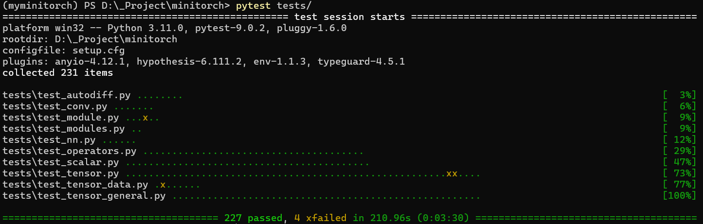
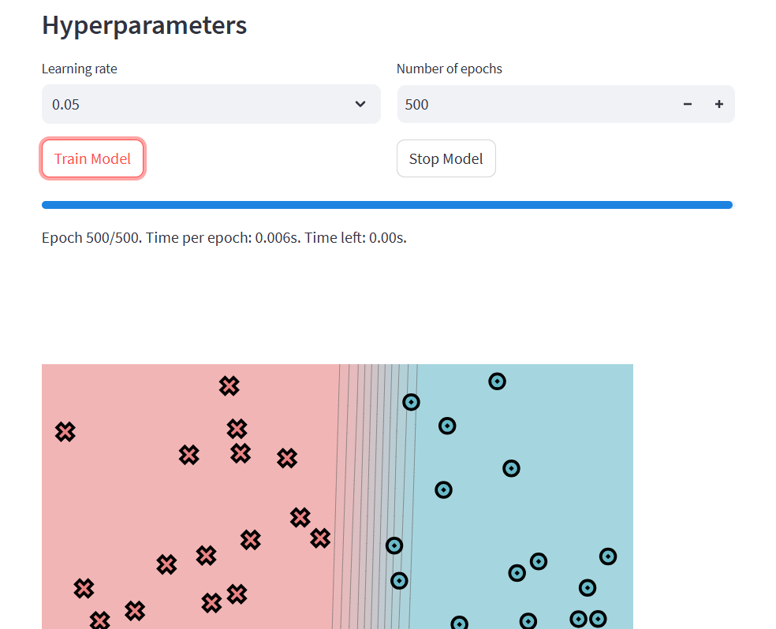

# MiniTorch

My Detailed Notes: [minitorch | 十派的玩具箱](https://meredith2328.github.io/post/minitorch/)

A compact deep learning systems project based on the MiniTorch teaching framework. This repository focuses on implementing core autodiff and tensor operators, then using them to train CNN models for sentiment classification and image classification.



## Features

- Implemented MiniTorch core components such as autodiff, tensor operations, module/parameter management, and fast operators.
- Implemented neural network operators including `Conv1D`, `Conv2D`, pooling, dropout, and `logsoftmax`.
- Ran end-to-end training on:
  - SST-2 sentiment classification
  - MNIST digit classification
- Added modern training scripts for easier reproduction with PyTorch and Hugging Face.

## Structure

```text
minitorch/
|- minitorch/                  # framework core
|- project/                    # original MiniTorch training scripts
|  |- run_sentiment.py
|  |- run_mnist_multiclass.py
|  |- app.py
|  |- data/
|- scripts/                    # modern training scripts
|  |- train_sentiment_hf.py
|  |- train_mnist_torch.py
|- tests/
|- requirements.txt
|- requirements-modern.txt
```

## Setup

```bash
conda create -n myminitorch python=3.11
conda activate myminitorch

pip install -r requirements.txt
pip install -e .
```

If you want to use the modern training scripts:

```bash
pip install -r requirements-modern.txt
```

## Data

### MNIST

Put the following files under `project/data/`:

- `train-images-idx3-ubyte`
- `train-labels-idx1-ubyte`

Example:

```bash
mkdir -p project/data
cd project/data

wget -c https://storage.googleapis.com/cvdf-datasets/mnist/train-images-idx3-ubyte.gz
wget -c https://storage.googleapis.com/cvdf-datasets/mnist/train-labels-idx1-ubyte.gz

gunzip -kf train-images-idx3-ubyte.gz
gunzip -kf train-labels-idx1-ubyte.gz
cd ../..
```

### SST-2 and GloVe

For the original MiniTorch sentiment script, it is recommended to set:

```bash
export HF_HOME=/root/shared-nvme/minitorch/project/data/hf_cache
export EMBEDDINGS_ROOT=/root/shared-nvme/minitorch/project/data
```

This stores:

- SST-2 cache under `project/data/hf_cache/`
- GloVe files under `project/data/glove/`

The modern Hugging Face sentiment script only needs `HF_HOME`; it does not use GloVe.

## Run

### Original MiniTorch scripts

```bash
python project/run_sentiment.py | tee sentiment.txt
python project/run_mnist_multiclass.py | tee mnist.txt
```

### Modern scripts

```bash
python scripts/train_sentiment_hf.py \
  --output-dir outputs/sst2-hf \
  --max-train-samples 2000 \
  --max-eval-samples 500

python scripts/train_mnist_torch.py \
  --data-dir project/data \
  --output-dir outputs/mnist-torch \
  --epochs 5
```

### Visualization

```bash
streamlit run project/app.py
```



## Resume Summary

Built and extended a MiniTorch-based deep learning systems project, implementing autodiff, tensor operators, and CNN modules, then validating the framework on SST-2 sentiment classification and MNIST image classification.
